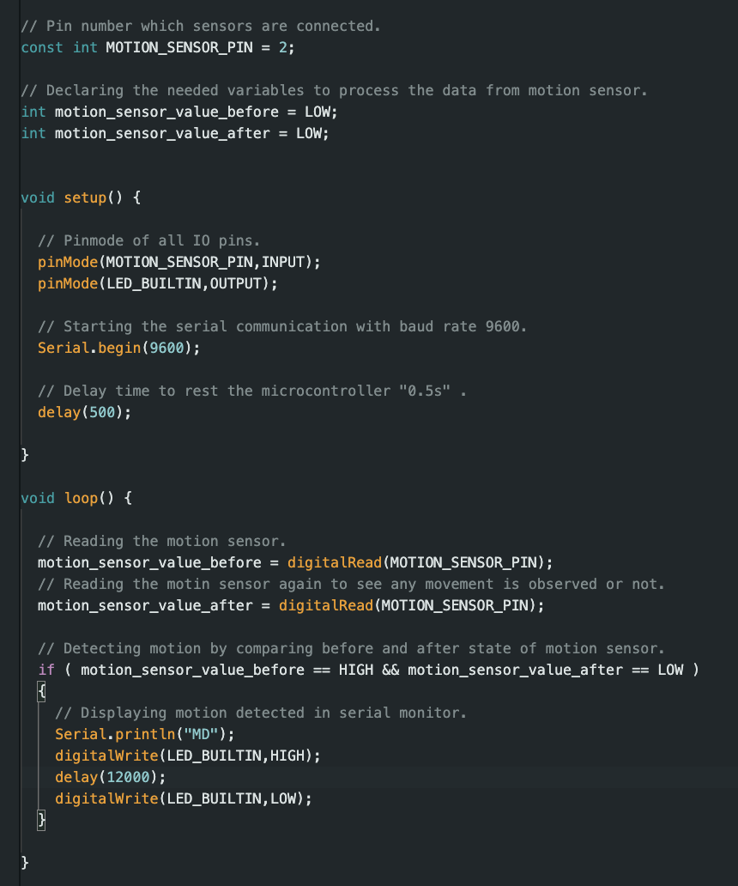
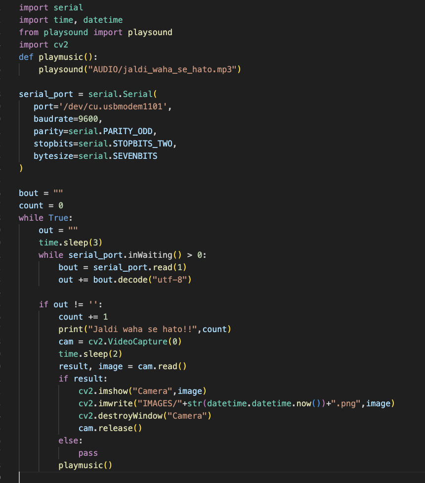

# Roommate Annoyer – Motion Detection, Audio Prank, and Reaction Capture

This project uses an Arduino and a motion sensor to detect presence in the room. When triggered, it sends a signal to a Python script on the laptop which plays an audio clip and captures a photo using the webcam.

The idea came from pure curiosity — to prank my roommate when I’m not around.

---

## Components Used

| Component                 | Quantity | Purpose                                     |
|--------------------------|----------|---------------------------------------------|
| Arduino Uno              | 1        | Handles motion detection                    |
| PIR Motion Sensor        | 1        | Detects presence                            |
| Laptop with Webcam       | 1        | Plays audio and captures image              |
| USB Cable                | 1        | Arduino-to-PC connection                    |

---

## How It Works

1. The PIR sensor detects motion and sends a signal to the Arduino.
2. Arduino transmits `"MD"` via Serial.
3. A Python script on the laptop listens for this signal.
4. On detection:
   - An audio message is played (e.g., “Jaldi waha se hato!”).
   - The laptop’s webcam takes a photo of the intruder.
   - The image is saved with a timestamp.

---

## Code Overview

### Arduino Sketch

### Python Script

---

## Demo

[Watch the Roommate Annoyer in Action](https://www.linkedin.com/posts/vishnuchityala_arduino-python-motiondetection-activity-7110895006944514049-F2N8)

---

## Notes

- Audio files and captured images are stored locally.
- Reaction images can be hilarious.
- This was just for fun — no roommates were harmed.
